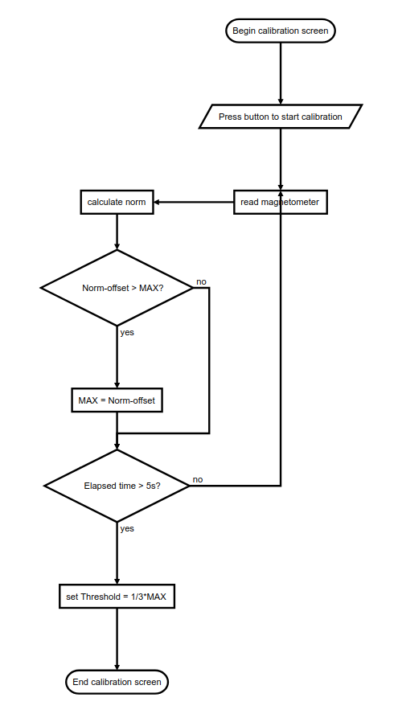
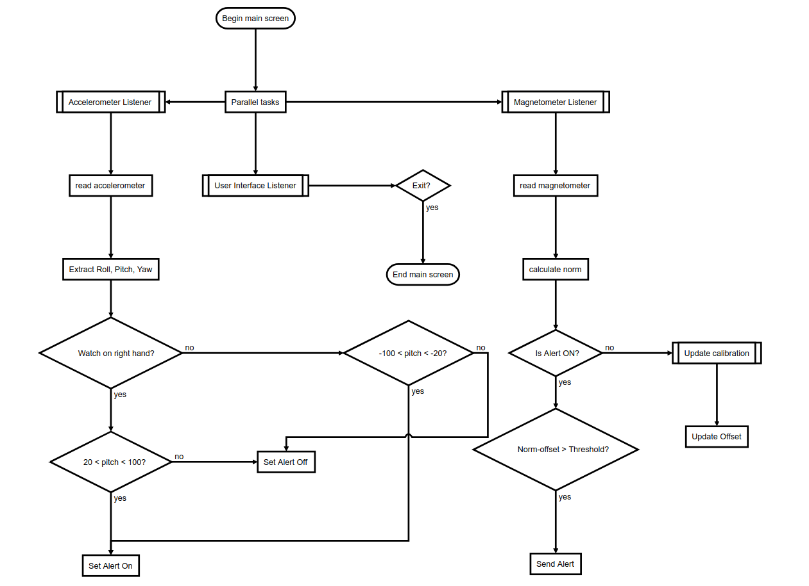
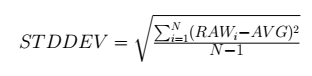

# No Face-Touch project

## Website
[Offical app Website](http://www.nofacetouch.org)

## License

[](http://badges.mit-license.org) **[MIT license](http://opensource.org/licenses/mit-license.php)**
- WatchOS App Copyright 2020 © Annino De Petra
- Android App  Copyright 2020 © Tommi, Gian, Nik e DP - SIRSLab, Università degli Studi di Siena

## Installation and Usage

### Android APK
[Click here to download the APK file](https://github.com/sirslab/COVID-19-DoNTYF-wear/raw/master/app/build/outputs/apk/debug/app-debug.apk)

### WatchOS App
The current App is available for all the Apple Watch series. The ones with a magnetometer ( 5th edition ) will have the support of the magnetometer along with the accelerometer to determine when an alert should be raised. The previous generations use the accelerometer only and an alert will be raised when the hand is moving towards the face.

 


## The idea behind the app
To help us stopping to touch our faces we developed a simple and free app that let your smartwatch vibrate and ring as soon as you get closer to your face. The face is detected by using a small cheap magnet at your necklace.  
The smartwatch is worn on the arm whose hand more frequently touches your face. We are using it on the left arm but you can choose the one you like. Of course we cannot alert if the hand without the smartwatch touches your face but we hope that preventing one hand only to touch our face can help us building safe habits for both hands. In any case for sure we reduce the risk by a factor 2. 

## App flow
We developed a WearOS standalone app that reads magnetometer measurements and detects the proximity with a magnet attached to a necklace or an ad-hoc accessory worn close to the face.
The app is composed of the following activities:
- Main activity: shows logos and collects users' agreements on using accelerometer and magnetometer data from the smartwatch
- Secondary activity: asks to the user which hand is wearing the smartwatch, then starts the calibration procedure. After the calibration, the app displays the norm of the magnetic field currently measured and provides alert whenever that value crosses a threshold. The user interface allows to manually adjust the threshold.

The calibration procedure fills a list with magnetometer measurements and takes the average as baseline value. Then, the user is asked to move his hand close to the magnetic necklace, in order to register the maximum value of magnetic field and 
automatically set a threshold equal to MAX*$1/3$.
The threshold scaling was defined empirically during the app debugging, any different suggestion to make the detection more robust will be taken into consideration.

After the calibration, the app estimates the hand orientation through accelerometer readings (for this reason we ask to the user where is he wearing the smartwatch). The app sends a vibration whenever the hand turns upward and the sensed magnetic field exceeds the current threshold.

Considering that the magnetic field shows substantial fluctutations in the enviroment, mostly due to EM sources and ferromagnetic materials, the baseline value is updated frequently. In particular, when the accelerometer data suggest that the hand is not pointing upward, the alerts (vibrations) are disabled and the magnetic field measurements are collected in the list to update the baseline value. 

## Block Diagrams
<table>
  <tr>
    <td>Hand Selection</td>
     <td>Calibration</td>
     <td>Main Screen</td>
  </tr>
  <tr>
    <td><a href="https://github.com/sirslab/COVID-19-DoNTYF-wear/blob/master/images/Hand_choice_block.png" target="_blank"></a></td>
    <td><a href="https://github.com/sirslab/COVID-19-DoNTYF-wear/blob/master/images/Block_calib_screen.png" target="_blank"></a></td>
    <td><a href="https://github.com/sirslab/COVID-19-DoNTYF-wear/blob/master/images/Block_main_screen.png" target="_blank"></a></td>
  </tr>
 </table>


To calculate Roll, Pitch and Yaw we used the following formula:
```
roll = atan2(acc[1], acc[2]) * 180/PI
pitch = atan2(-acc[0], sqrt(acc[1]*acc[1] + acc[2]*acc[2])) * 180/PI
yaw = 0
```
where acc[0], acc[1] and acc[2] represent the accelerations sensed along the x, y and z axes, respectively.
Yaw is not required for our purpose.


### TODOs

1. During the hand selection phase, fill the buffer with Norm of the magnetometer readings. Then calculate average (AVG) and standard deviation (STDDEV). 
To calculate the standard deviation use either the function implemeted for the buffer structure if available (e.g. buffer.std) or the standard formula:

where RAW(t) is the current raw sample in the buffer.
2. After pressing the CALIBRATE button (this should work both during initial calibration and after pressing the calibration button in the main activity) stop filling the offset buffer. Instead, look for the maximum value measured in 5 seconds (always subtracting the offset from the raw value). At the end of the calibration phase, our calibration/scaling factor is given by the MAXIMUM value recorded divided by the standard deviation (STDDEV) previously measured.
calFactor = MAX/STDDEV
3. In the main activity, when the accelerometer condition is checked and the current value (raw norm - offset) is higher than (STAND DEV )*(calibration factor), send an alert.
4. The calibration factor can be automatically calculatd by pressing the CALIBRATE button in the main activity screen, and manually adjusted using the seekbar or (+/-) buttons.


- [ ] Aggiungere file per salvataggio preferenze (Privacy, Soglia, Mano) in Android
- [x] Mettere il testo della privacy scrollabile
- [x] Aggiungere un bip
